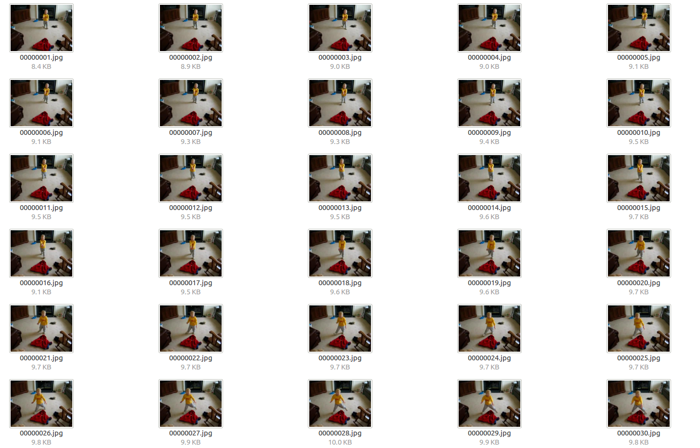

# Visual_Tracking_api


This is a simple visual tracking interface coding by Python2.7

## Introduction

This repository contains the following contents：

`tutorials` folder contains the implementation and tutorial of various famous tracking algorithms written with ipython-notebook. Learning these notebooks helps you understand the details of the algorithms.

`pyhog` folder includes a implementation of HOG feature. We copied this implementation from https://github.com/dimatura/pyhog

python wrapper script file named `XXXtracker.py`，such as `KCFtracker.py`. These trackers can be integrated into the VOT evaluation process. There is a demo file `vot_demo_tracker.py` representing how to write the wrapper script file.
You can refer to < Usage > for getting more information.

## Trackers

Trackers that have been implemented are as follows:

- `KCFtracker.py` High-Speed Tracking with Kernelized Correlation Filters (KCF) [[PDF]](http://home.isr.uc.pt/~henriques/publications/henriques_tpami2015.pdf)

- `DSSTtracker.py` Accurate Scale Estimation for Robust Visual Tracking (DSST) [[PDF]](http://www.cvl.isy.liu.se/en/research/objrec/visualtracking/scalvistrack/ScaleTracking_BMVC14.pdf)

- `HCFtracker.py` Hierarchical Convolutional Features for Visual Tracking (HCF) [[PDF]](https://www.cv-foundation.org/openaccess/content_iccv_2015/papers/Ma_Hierarchical_Convolutional_Features_ICCV_2015_paper.pdf)

## Environment

Python 2.7.12

scikit-image 0.13.0

scipy 0.19.1

matplotlib 1.5.3

numpy 1.13.1

pytorch 0.1.12

opencv 2.4.11

## Usage

### Prepare

Before using the tracking interface, you must do some preparation.

First of all, install the necessary library (mentioned in < Environment >)

Then, if the algorithm requires hog features, you must move the folder `pyhog` to Python site-packages by:

```buildoutcfg
sudo cp -r .../Visual_Tracking_api/pyhog /usr/local/lib/python2.7/site-packages
```

Or the algorithm requires deep features (we use pretrained vgg19 in general), you need to download model file 'vgg19.pth' by url:

https://download.pytorch.org/models/vgg19-dcbb9e9d.pth

and place it in project directory.

### Tracking on you own sequence

You can use this tool to track on you own sequence:

Make sure that your video has been decomposed into image sequences and each image is named with a number
(if the current image corresponds to the ith frame in the video, then the name is i.jpg or 0000i.jpg, adding 0 in front of the i is OK). For example:



Except for the image sequence, you need to provide `groundtruth.txt` file which represents the boundingbox infromation.
The boundingbox of the first frame must be give, so there are at least one line in the `groundtruth.txt` file. 
 For example:
```
20.0,30.0,50.0,100.0
```
Represents the boundingbox at (20.0, 30.0) position, width and height are respectively 50.0, 100.0.
Of course, if there are other frames of boundingbox information, it can also be written in `groundtruth.txt`.

We provide tools to run algorithms on custom sequences.
`example.py` is an demo for understanding how to use. First, you need to configure the sequence by 

```python
sequence = Sequence(path='/YOUR_ROOT_DIR/YOUR_DATASET_NAME', name='THE_NAME_OF_SEQUENCE', region_format='rectangle')

```

For example, configure a sequence of vot2016:

```python
sequence = Sequence(path='/media/maoxiaofeng/project/GameProject/dataset/vot2016', name='bag',
region_format='rectangle')

```

Then, run tracking algorithms on the configured sequence by
(If you want to visualize the result, modify `visualize` to True)

```python
Tracking(sequence,tracker_list=['KCFtracker','DSSTtracker'],visualize = False)

```

Also you can visulize results directly by ( `visualize_gt` controls whether to visualize the groundtruth. If `tracker_list` is None, this function will only visualize the groundtruth. )

```python
visulize_result(sequence,tracker_list=['KCFtracker','DSSTtracker'],visualize_gt = True)
```


### Evaluate on VOT dataset

Now the interface is compatible with VOT dataset, use [vot-toolkit](https://github.com/votchallenge/vot-toolkit) to evaluate the tracking algorithm on VOT datasets.

You can download Visual Object Tracking (VOT) challenge datasets through the following links:

[VOT2015](http://data.votchallenge.net/vot2015/vot2015.zip), [VOT2016](http://data.votchallenge.net/vot2016/vot2016.zip), [VOT2014](http://data.votchallenge.net/vot2014/vot2014.zip), [VOT2013](http://data.votchallenge.net/vot2013/vot2013.zip)

Then set up VOT workspace (http://www.votchallenge.net/howto/workspace.html) and integrate trackers into the VOT toolkit (http://www.votchallenge.net/howto/integration.html)

For detail information, please visit VOT official website：http://www.votchallenge.net/

